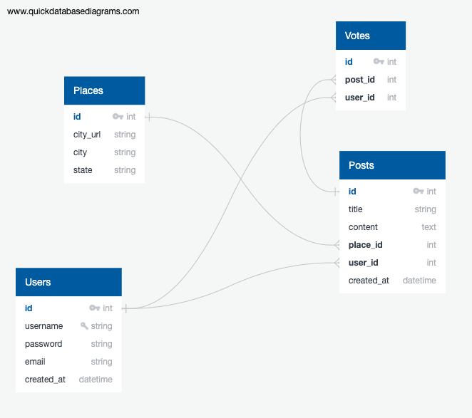

# 
CrimeScope

## <a href="https://crime-scope.herokuapp.com/signup">CrimeScope Website</a>

## APIs:

<a href="https://rapidapi.com/apimaker/api/find-places-to-live/">Rapid API "Find Places to Live"</a>

<a href="https://platform.openai.com/docs/introduction">Chat GPT API</a>

## Database Schema:

## Stack

- Python
- Flask
- PostgreSQL
- SQL-Alchemy
- Heroku
- Tailwind CSS
- Jquery
- Axios

## Features

- Crime data presentation: I utilized data obtained from <a href="https://rapidapi.com/apimaker/api/find-places-to-live/"> Rapid API "Find Places to Live" </a> to provide an easily comprehensible representation of crime trends in the US through the use of percentages and tables. When searching for crime data in a specific areas, I often found the information overwhelming and difficult to comprehend. That's why I made it a priority to avoid information overload while presenting the data in an easily understandable format, with clear explanations and contextual information.

- Personalized safety tips: Our website uses <a href="https://platform.openai.com/docs/introduction"> Chat GPT API </a> to generate safety tips tailored to your location, crime type, and other relevant factors. You can generate new responses to provide a variety of responses. I wanted to go above and beyond by incorporating AI-generated safety tips and user contributions on my website. As someone who has experienced uncertainty and feeling unsafe while traveling or relocating to a new area, I wanted to create a resource that could provide personalized advice to help people feel more secure and confident in their surroundings.

- Community engagement: I encourage users to share their experiences and safety tips with others in their community. Specially those who are familiar to an area. My goal in implementing this feature was to create a sense of community and encourage users to share their experiences and tips, ultimately promoting safety and education about unfamiliar areas. By gathering the collective knowledge of users, we can create a platform that helps people make informed decisions and stay safe in their neighborhoods.

## User flow

- When a user visits my site, they have the option to either create an account or log in. On the landing page, I provide a brief introduction to the site.
- Once logged in, users can search for crime data by city or city and state.
- The search results page includes crime data presentations, personalized safety tips generated by AI, a form to post their own safety tips, and a feed of other users' posts in that area. Users can upvote other users' posts to show their support.
- Additionally, users have their own profile accessible through the navigation bar. The profile page includes a form to update their username or email address, as well as the option to delete their account entirely. Users can also view and manage their own posts on their profile page.
